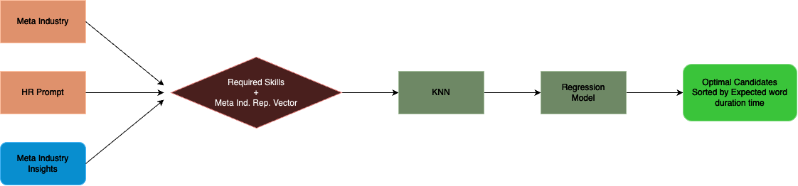

<h1 align='center' style="text-align:center; font-weight:bold; font-size:2.5em"> Data Collection Project Candidiate Locater</h1>

    <a>Majd Bishara</a>&nbsp;,&nbsp;
    <a>Saleem Kheer-Eldeen</a>&nbsp;,&nbsp;
    <a>Tameer Milhem</a>&nbsp;,&nbsp;
    <a>Lana Haj</a>&nbsp;
      
    Cornell Tech  
    

# Contents

- [Overview](#overview)
- [Example](#example)
- [Files](#files)
  - [Data](#data)
  - [Notebooks](#notebooks)
  - [Assets](#assets)

## Overview

The "Candidate Locator" project introduces an advanced solution to streamline candidate selection processes within organizations. By harnessing the power AI, particularly LLMs, alongside thorough data collection and processing methods, the project aims to optimize recruitment efforts and identify optimal candidates for specific roles.

At its core, the project employs a pipeline, taking input `meta_indsutry` represeting the recruiter's industry and `prompt` which is the recruitter's description of the candidate they seek, then using LLMs and sophistacated embeddings we find a set of potential candidates which we order according to their expected work duration using a regression model.

By automating candidate selection and tenure prediction, the "Candidate Locator" project offers a data-driven approach to hiring, promising enhanced efficiency and informed decision-making for organizations seeking to secure top talent.

## Example

To run an example head to [Pipeline Notebook](data/notebooks/Pipeline.ipynb), locate the code ?>?, as an example: 
- `meta_industry = Technology`
- `prompt = Looking for individuals skilled in HTML, CSS, and JavaScript for front-end web development.`

Run the notebook

**Output:**
|id|name|description|expected duration (months)|
|--|----|-----------|-----------------|
|1|James|Experienced Front-End Developer with 3+ year experience in Java, HTML, CSS and Javascript| 24|
|...|...|...| ...|

## Files

### Data

There are 3 external Datasets used throughout the project:
- [Job Listings (scrapped)]()
- [People Skills]()
- [Job Requiremenets]()

### Notebooks

There are 3 notebooks that are divided by subject, the notebook were writting through databricks and should be ran using it:
- [Data Analysis]() - Comprehensive analysis of the data with interactive visualizations
- [Pipline]() - Implementation of the pipeline described
- [Insights]() - Insights about the different meta industries

### Assets

Mention any additional assets or resources used in the project, such as images, documents, or libraries.
